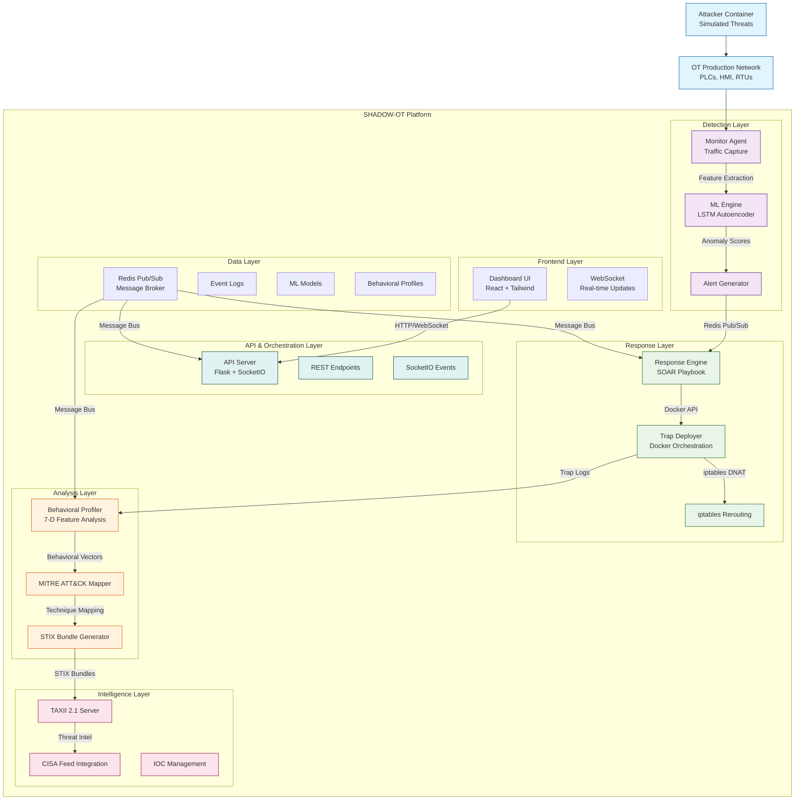
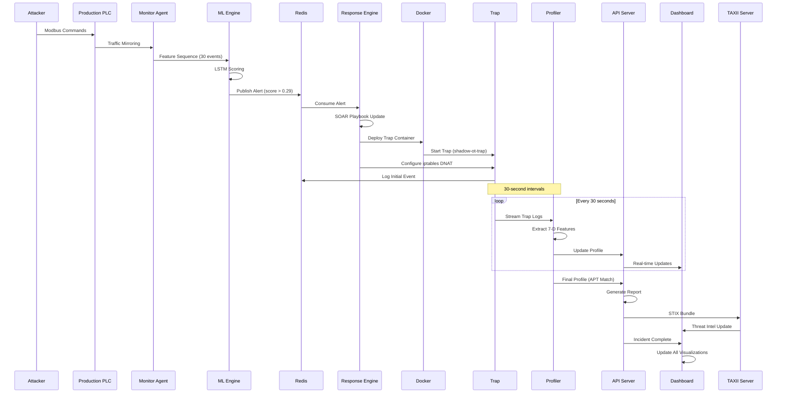
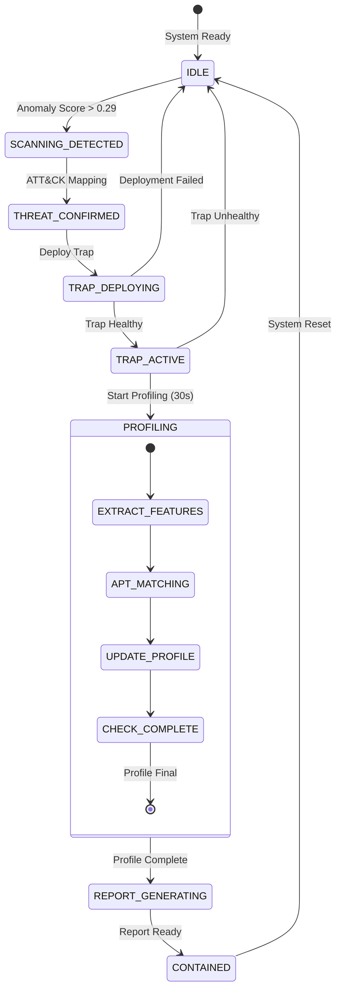
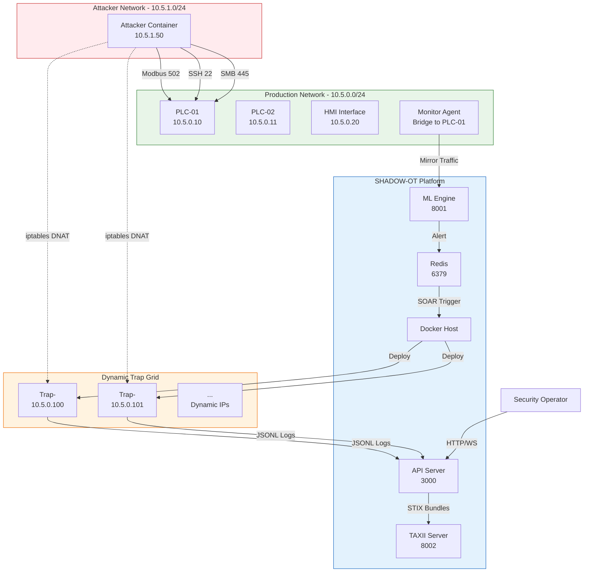

# SHADOW-OT System Architecture Flowcharts

## Overview

This document provides comprehensive system architecture flowcharts for the SHADOW-OT platform in multiple formats:

1. **High-Level System Architecture** (Complete system view)
2. **Data Flow Diagram** (Real-time processing pipeline)
3. **Component Interaction Diagram** (Microservices communication)
4. **Incident Response Workflow** (SOAR playbook sequence)
5. **Network Topology** (Physical/Virtual network layout)

---

## 1. High-Level System Architecture

### Mermaid.js Diagram



### Text Description

```
┌─────────────────────────────────────────────────────────────────────────────┐
│                           SHADOW-OT PLATFORM                                │
├─────────────────────────────────────────────────────────────────────────────┤
│  ┌─────────────┐     ┌─────────────────┐     ┌─────────────────┐           │
│  │  FRONTEND   │◄───►│  API LAYER      │◄───►│  DATA LAYER     │           │
│  │  Dashboard  │     │  Flask +        │     │  Redis Pub/Sub  │           │
│  │  WebSocket  │     │  SocketIO       │     │  Event Logs     │           │
│  └─────────────┘     └─────────────────┘     └─────────────────┘           │
│         ▲                      ▲                      ▲                    │
│         │                      │                      │                    │
│  ┌──────┴──────┐      ┌───────┴──────┐      ┌────────┴────────┐           │
│  │ DETECTION   │      │  RESPONSE    │      │   ANALYSIS      │           │
│  │  Layer      │      │   Layer      │      │    Layer        │           │
│  │ • Monitor   │─────►│ • SOAR       │─────►│ • Profiler      │           │
│  │ • ML Engine │      │ • Trap       │      │ • ATT&CK        │           │
│  │ • Alerts    │      │ • Rerouting  │      │ • STIX          │           │
│  └─────────────┘      └──────────────┘      └─────────────────┘           │
│         ▲                      ▲                      ▲                    │
│         │                      │                      │                    │
│  ┌──────┴──────┐      ┌───────┴──────┐      ┌────────┴────────┐           │
│  │ INTELLIGENCE│      │  EXTERNAL    │      │   EXTERNAL      │           │
│  │   Layer     │      │   SYSTEMS    │      │   THREATS       │           │
│  │ • TAXII     │◄────►│ • PLCs       │◄────►│ • Attackers     │           │
│  │ • CISA Feed │      │ • HMI        │      │ • APTs          │           │
│  │ • IOC Mgmt  │      │ • SCADA      │      │                 │           │
│  └─────────────┘      └──────────────┘      └─────────────────┘           │
└─────────────────────────────────────────────────────────────────────────────┘
```

---

## 2. Real-Time Data Flow Diagram

```mermaid
flowchart LR
    %% Attack Flow
    A[Attacker] -->|Modbus Traffic| PLC[Production PLC]
    
    %% Detection Flow
    PLC -->|Traffic Mirroring| M[Monitor Agent]
    M -->|Feature Extraction| F[6 Features<br/>per Event]
    F -->|Sequence Building| S[30-Event Sequence]
    S -->|ML Scoring| ML[LSTM Autoencoder]
    ML -->|Anomaly Score| DEC{Score > 0.29?}
    
    %% Response Flow
    DEC -- YES --> ALERT[Alert Generation]
    ALERT -->|Redis Pub/Sub| RE[Response Engine]
    RE -->|SOAR Playbook| STATE{Playbook State}
    
    STATE -- SCANNING_DETECTED --> CONFIRM[Threat Confirmation]
    CONFIRM -->|ATT&CK Mapping| STATE2{THREAT_CONFIRMED}
    
    STATE2 -- YES --> DEPLOY[Trap Deployment]
    DEPLOY -->|Docker API| TRAP[Trap Container]
    TRAP -->|iptables DNAT| REROUTE[Traffic Rerouting]
    REROUTE -->|Attacker→Trap| TRAPLOG[Trap Logging]
    
    %% Analysis Flow
    TRAPLOG -->|JSONL Events| PROF[Behavioral Profiler]
    PROF -->|7-D Feature Vector| APT[APT Matching]
    APT -->|Confidence Score| REPORT[Incident Report]
    
    REPORT -->|PDF + STIX| INTEL[Threat Intelligence]
    INTEL -->|TAXII Server| SHARE[Intel Sharing]
    
    %% UI Flow
    SHARE -->|WebSocket| UI[Dashboard Updates]
    UI -->|Real-time Display| OPERATOR[Security Operator]
    
    %% Styling
    classDef attack fill:#ffebee,stroke:#c62828
    classDef detection fill:#f3e5f5,stroke:#7b1fa2
    classDef response fill:#e8f5e8,stroke:#2e7d32
    classDef analysis fill:#fff3e0,stroke:#ef6c00
    classDef ui fill:#e3f2fd,stroke:#1565c0
    
    class A,PLC attack
    class M,F,S,ML,DEC detection
    class ALERT,RE,STATE,CONFIRM,STATE2,DEPLOY,TRAP,REROUTE response
    class TRAPLOG,PROF,APT,REPORT,INTEL,SHARE analysis
    class UI,OPERATOR ui
```



### Data Flow Timeline

```
TIMELINE: Complete Incident Response (90 seconds)
├── 0-5s: DETECTION PHASE
│   ├── Attacker sends Modbus commands
│   ├── Monitor captures traffic
│   ├── ML engine scores sequence
│   └── Alert generated if score > 0.29
│
├── 5-10s: CONFIRMATION PHASE
│   ├── SOAR playbook: SCANNING_DETECTED
│   ├── ATT&CK technique mapping
│   └── State: THREAT_CONFIRMED
│
├── 10-35s: CONTAINMENT PHASE
│   ├── Trap container deployment
│   ├── iptables DNAT rules applied
│   ├── Traffic rerouted to trap
│   └── State: TRAP_ACTIVE
│
├── 35-70s: ANALYSIS PHASE
│   ├── Behavioral profiling (30s interval)
│   ├── APT signature matching
│   ├── 7-D feature vector calculation
│   └── State: PROFILING
│
├── 70-90s: REPORTING PHASE
│   ├── Incident report generation
│   ├── STIX bundle creation
│   ├── TAXII feed update
│   └── State: CONTAINED
│
└── 90s+: RESOLUTION
    ├── Dashboard notifications
    ├── Operator review
    └── System reset for next incident
```

---

## 3. Component Interaction Diagram



### Microservices Communication Matrix

| From Component | To Component | Protocol | Data Format | Purpose |
|----------------|--------------|----------|-------------|---------|
| **Monitor** | **ML Engine** | HTTP/REST | JSON | Feature sequence scoring |
| **ML Engine** | **Redis** | Redis Pub/Sub | JSON | Anomaly alert publishing |
| **Redis** | **Response Engine** | Redis Pub/Sub | JSON | Alert consumption |
| **Response Engine** | **Docker** | Docker API | JSON | Container orchestration |
| **Response Engine** | **Trap Container** | iptables | CLI commands | Network rerouting |
| **Trap Container** | **Profiler** | File I/O | JSONL | Behavioral log streaming |
| **Profiler** | **API Server** | HTTP/REST | JSON | Profile updates |
| **API Server** | **Dashboard** | WebSocket | JSON | Real-time UI updates |
| **API Server** | **TAXII Server** | HTTP/REST | STIX JSON | Intelligence sharing |
| **TAXII Server** | **External Feeds** | TAXII 2.1 | STIX JSON | IOC distribution |

---

## 4. Incident Response Workflow (SOAR Playbook)



### Playbook State Transitions

| State | Trigger | Action | Next State |
|-------|---------|--------|------------|
| **IDLE** | Anomaly score > 0.29 | Publish alert, map techniques | SCANNING_DETECTED |
| **SCANNING_DETECTED** | ATT&CK technique confirmed | Validate threat, update UI | THREAT_CONFIRMED |
| **THREAT_CONFIRMED** | Threat validation complete | Deploy trap container | TRAP_DEPLOYING |
| **TRAP_DEPLOYING** | Container started | Configure iptables, wait for health | TRAP_ACTIVE |
| **TRAP_ACTIVE** | Trap healthy (HTTP 200) | Start profiler thread | PROFILING |
| **PROFILING** | 30-second interval | Extract features, match APTs | PROFILING (loop) |
| **PROFILING** | Profile marked "final" | Generate reports | REPORT_GENERATING |
| **REPORT_GENERATING** | PDF + STIX complete | Update TAXII, notify UI | CONTAINED |
| **CONTAINED** | Report delivered | Reset system, clean traps | IDLE |

---

## 5. Network Topology Diagram



### Network Port Mapping

| Service | Container Port | Host Port | Protocol | Purpose |
|---------|---------------|-----------|----------|---------|
| **API Server** | 3000 | 3000 | HTTP/WebSocket | Dashboard + REST API |
| **ML Engine** | 8001 | 8001 | HTTP | Anomaly scoring |
| **TAXII Server** | 8002 | 8002 | HTTPS | Threat intelligence |
| **HMI Interface** | 5000 | 5050 | HTTP | Human-Machine Interface |
| **Redis** | 6379 | 6379 | TCP | Message broker |
| **Modbus** | 502 | - | TCP | Industrial protocol |
| **SSH** | 22 | - | TCP | Secure shell (trapped to 2222) |
| **SMB** | 445 | - | TCP | File sharing |

### Traffic Rerouting Rules

```bash
# iptables DNAT Rules Applied by Response Engine
iptables -t nat -I PREROUTING \
  -s 10.5.1.50 -p tcp --dport 502 \
  -j DNAT --to-destination 10.5.0.100:502

iptables -t nat -I PREROUTING \
  -s 10.5.1.50 -p tcp --dport 22 \
  -j DNAT --to-destination 10.5.0.100:2222

iptables -t nat -I PREROUTING \
  -s 10.5.1.50 -p tcp --dport 445 \
  -j DNAT --to-destination 10.5.0.100:445
```

---

## 6. Behavioral Profiling Flowchart

```mermaid
flowchart TD
    START[Start Profiling] --> LOGS[Read Trap Logs]
    LOGS --> FILTER[Filter Modbus Commands]
    FILTER --> EXTRACT[Extract 7 Features]
    
    subgraph FEATURE_CALCULATION[Feature Calculation]
        F1[Command Rate<br/>c₀ = N_c / (T·R_max)]
        F2[Scan Coverage<br/>c₁ = A_p / A_t]
        F3[Automation Score<br/>c₂ = 1 - CV(Δt)]
        F4[Modbus Expertise<br/>c₃ = F_v / F_t]
        F5[Write Aggression<br/>c₄ = F_w / F_t]
        F6[Lateral Attempts<br/>c₅ = (I_d-1) / I_max]
        F7[Stealth Index<br/>c₆ = 1 - (0.5c₀+0.3c₁+0.2c₄)]
    end
    
    EXTRACT --> FEATURE_CALCULATION
    FEATURE_CALCULATION --> VECTOR[7-D Feature Vector]
    
    VECTOR --> APT_COMPARE[Compare with APT Signatures]
    
    subgraph APT_SIGNATURES[Known APT Profiles]
        TRITON[TRITON/TRISIS<br/>c₃:0.95, c₆:0.25]
        PIPEDREAM[PIPEDREAM<br/>c₃:0.98, c₆:0.90]
        INDUSTROYER[INDUSTROYER<br/>c₁:0.90, c₄:0.60]
    end
    
    APT_COMPARE --> SIMILARITY[Cosine Similarity]
    SIMILARITY --> THRESHOLD{Score > 0.7?}
    
    THRESHOLD -- YES --> MATCH[APT Match Identified]
    THRESHOLD -- NO --> UNKNOWN[Unknown Attacker]
    
    MATCH --> CONFIDENCE[Confidence: Score×100%]
    CONFIDENCE --> OUTPUT[Profile Output]
    UNKNOWN --> OUTPUT
    
    OUTPUT --> UPDATE[Update Dashboard]
    UPDATE --> NEXT{30s elapsed?}
    NEXT -- YES --> LOGS
    NEXT -- NO --> WAIT[Wait...]
    WAIT --> NEXT
```

### 7-D Behavioral Feature Definitions

| Feature | Symbol | Formula | Range | Interpretation |
|---------|--------|---------|-------|----------------|
| **Command Rate** | c₀ | \( \min(1.0, \frac{N_c}{T \cdot R_{max}}) \) | 0.0-1.0 | Automation level |
| **Scan Coverage** | c₁ | \( \min(1.0, \frac{A_p}{A_t}) \) | 0.0-1.0 | Address space exploration |
| **Automation Score** | c₂ | \( \max(0.0, 1.0 - \frac{\sigma_\Delta}{\mu_\Delta}) \) | 0.0-1.0 | Timing regularity |
| **Modbus Expertise** | c₃ | \( \frac{F_v}{F_t} \) | 0.0-1.0 | Protocol knowledge |
| **Write Aggression** | c₄ | \( \frac{F_w}{F_t} \) | 0.0-1.0 | Destructive intent |
| **Lateral Attempts** | c₅ | \( \min(1.0, \frac{I_d - 1}{I_{max}}) \) | 0.0-1.0 | Network exploration |
| **Stealth Index** | c₆ | \( \max(0.0, 1.0 - (0.5c_0 + 0.3c_1 + 0.2c_4)) \) | 0.0-1.0 | Operational stealth |

---

## Usage Instructions

### For Documentation
Copy any Mermaid.js diagram code block into:
- GitHub/GitLab README files (auto-renders)
- Markdown documentation
- Confluence pages with Mermaid plugin
- Technical reports

### For Presentations
1. Use the **High-Level Architecture** diagram for overview slides
2. Use the **Data Flow Diagram** for technical deep dives  
3. Use the **Incident Response Workflow** for process explanations
4. Use the **Network Topology** for infrastructure discussions

### For Implementation
Refer to the **Component Interaction Diagram** and **Microservices Communication Matrix** for:
- API integration points
- Data format specifications
- Protocol requirements
- Port configurations

### For Research Papers
Include the **Behavioral Profiling Flowchart** and **7-D Feature Definitions** in:
- Methodology sections
- System design descriptions
- Evaluation methodology

---

## Export Formats

All diagrams are available in multiple formats:

1. **Mermaid.js** (included above) - Interactive web rendering
2. **PNG/SVG** - Export using:
   - [Mermaid Live Editor](https://mermaid.live)
   - GitHub/GitLab automatic rendering
   - VS Code Mermaid extension
3. **PDF** - Include in LaTeX documents
4. **PPTX** - Copy as images to presentation slides

---

## Version History

| Version | Date | Changes |
|---------|------|---------|
| 1.0 | June 22, 2026 | Initial release with 6 comprehensive flowcharts |
| 1.1 | June 22, 2026 | Added behavioral profiling details and formulas |

---

**Note**: All diagrams are based on actual SHADOW-OT implementation details from the codebase. They accurately represent the system architecture, data flows, and component interactions as implemented.